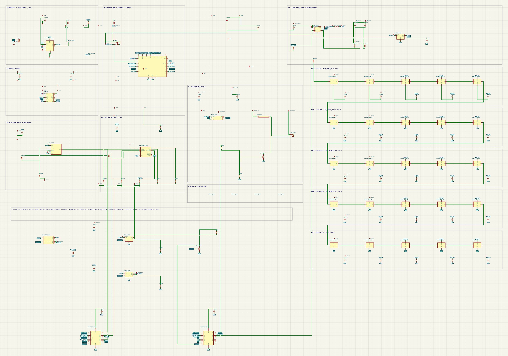
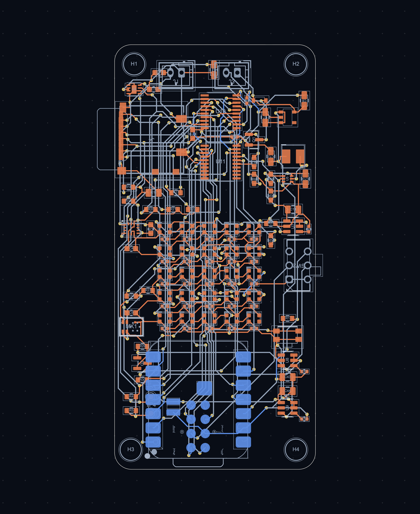

# AI Pendant Recorder

An open-source, privacy-first wearable audio recorder built around the Seeed XIAO ESP32S3. It records PDM microphone audio to removable microSD storage and uses a 5 × 5 RGB matrix for low-power status feedback.

## Hardware

- Seeed XIAO ESP32S3 **113991114** controller
- Infineon IM69D130 PDM microphone
- Molex 104031-0811 microSD socket
- MAX17048 fuel gauge and BMI270 IMU
- Regulated haptic output
- 25 × WS2812C-2020-V1 RGB LEDs
- Protected 500 mAh 1S LiPo design target
- No camera or speaker

## Schematics

[](docs/images/schematic.png)

The schematic is generated from [`pcb/ai_pendant_recorder.zen`](pcb/ai_pendant_recorder.zen) and is organized into battery/fuel-gauge, controller, motion, microphone, storage, haptics, LED power, and LED-row sections. Open the image for the full-resolution view.

## Board

[](docs/images/board-layout.png)

The current four-layer KiCad board is in [`pcb/layout/layout.kicad_pcb`](pcb/layout/layout.kicad_pcb). It has a closed 36 × 76 mm rounded outline, four mounting holes, 115 footprints, 1,264 track segments, 200 vias, and no reported airwires.

Fresh checks on the current board:

| Check | Result |
|---|---|
| Zener source build | Pass — 115 components |
| ERC | Pass — 0 errors, 0 warnings, 79 style advice |
| KiCad DRC | **1 error**, 115 footprint-library configuration warnings |
| PDK-backed DFM | Pass — 0 findings |
| Firmware clean build | Pass for `seeed_xiao_esp32s3` |
| Enclosure CAD build | Pass — 16 valid solids |

The remaining DRC error is a 0.21 mm clearance between the IM69D130 acoustic opening and its surrounding ground pad, below the board-wide 0.25 mm hole-clearance rule. The geometry follows Infineon's recommended 0.8 mm sound port and SMD ground-pad land pattern, but the exception still needs an explicit KiCad rule or footprint-level resolution before the PCB checks are fully clean. The library warnings are caused by the standalone KiCad checker not loading the project-managed footprint libraries; they are not geometry violations.

## Firmware

The Arduino/PlatformIO firmware currently provides:

- push-to-toggle 16-bit PDM audio capture;
- chunked WAV recording to FAT32 microSD;
- recovery of interrupted `.part` recordings at startup; and
- conservative idle/recording animations on the RGB matrix.

Wi-Fi upload, fuel-gauge monitoring, motor activation, and automatic file deletion are not implemented.

### Build

1. Install [PlatformIO](https://platformio.org/).
2. Clone this repository and enter it.
3. Build the default environment:

   ```sh
   pio run
   ```

4. Connect a Seeed XIAO ESP32S3 and upload:

   ```sh
   pio run --target upload
   pio device monitor --baud 115200
   ```

Use a qualified FAT32 microSD card. Hardware pin assignments are documented in [`docs/current-design.md`](docs/current-design.md); setup notes are in [`docs/setup.md`](docs/setup.md).

## Repository map

| Path | Purpose |
|---|---|
| `src/main.cpp` | Recorder firmware entry point |
| `include/` | Shared firmware configuration and WAV helpers |
| `tests/` | Host-side audio-format test |
| `pcb/ai_pendant_recorder.zen` | Electrical and connectivity source |
| `pcb/layout/` | Current KiCad PCB and schematic |
| `pcb/bom.json` | Structured generated BOM |
| `docs/bom.md` | Human-readable procurement notes |
| `mechanical/` | Parametric enclosure source and current PCB STEP import |

## Engineering status

The current source, PCB, firmware, and enclosure generators are maintained together and were freshly built or checked. Remaining hardware work is tracked in [`docs/current-design.md`](docs/current-design.md), including the microphone DRC rule, power and charging validation, exact motor selection, enclosure interface dimensions, and physical bench testing.

## Contributing

Issues and pull requests are welcome. Keep changes focused, identify the hardware revision they target, and include validation evidence where practical. Do not commit credentials, private recordings, generated build directories, or unreviewed manufacturing outputs.

## License

This project is intended to be open source, but no license file is currently present. Until the maintainers add one, copyright law reserves reuse rights; please open an issue before redistributing or incorporating the design.
